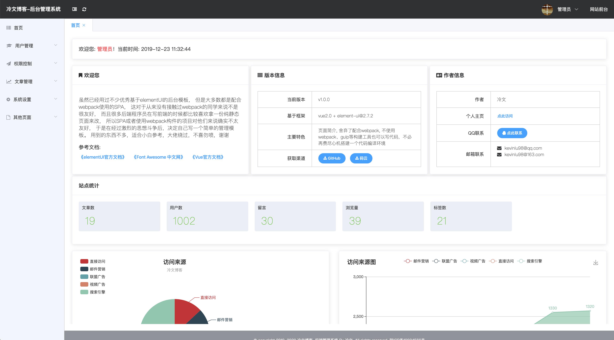
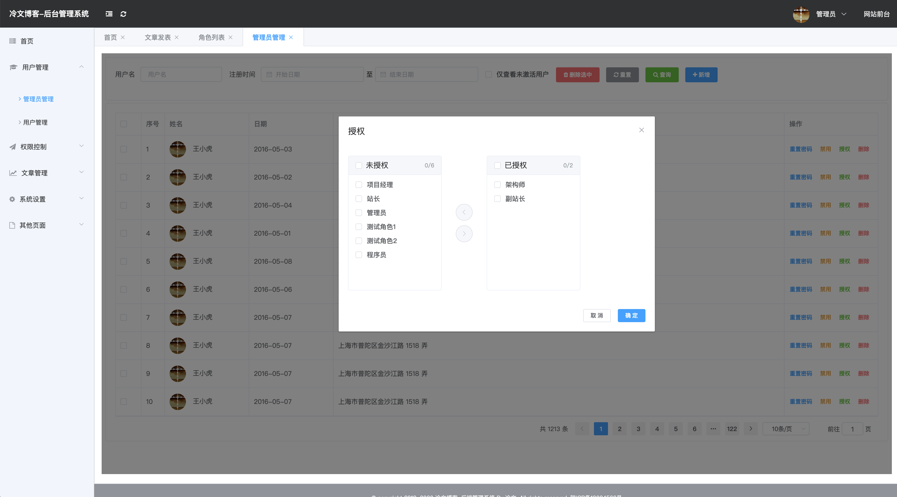

## lw-admin
一个基于Vue+elementUI的多iframe窗口后端模板

## 说明
虽然已经用过不少优秀基于elementUI的后台模板， 但是大多数都是配合webpack使用的SPA， 这对于从来没有接触过webpack的同学来说不是很友好， 而且很多后端程序员在写前端的时候都比较喜欢拿一份纯静态页面来改， 所以SPA或者使用webpack构件的项目对他们来说确实不太友好， 于是在经过激烈的思想斗争后，决定自己写一个简单的管理模板。 用到的东西不多，适合小白参考，大佬绕过，不喜勿喷，谢谢

## 简介
- **架构**: 基于iframe，纯HTML，舍弃了webpack，让一些前端不太友好的后端程序员也可以轻易使用
- **菜单**: 支持二级菜单，菜单可折叠为竖排图标，菜单格式
    ```javascript
    [{
        id: 2, //菜单唯一标识
        name: '权限控制',
        icon: 'fa fa-paper-plane', //图标，支持Font Awesome图标
        info: '对系统角色权限的分配等设计，敏感度较高，请谨慎授权',//菜单说明
        //子菜单列表
        childList: [
            {
                id: '2-1',
                name: '角色列表',
                url: 'permission/role.html',//对应打开iframe的URL
                parentId: 2
            },
            {
                id: '2-2',
                name: '菜单列表',
                url: 'permission/menu.html',
                parentId: 2
            }
        ],
        parentId: 0 //父菜单id，0表示该菜单为顶级菜单
    },
    {...}]
    ```
    - 菜单预览
    展开
    
    折叠
    
- **基础**: 只需要会一点前端基础就可以了，大家完全可以参考[elementUI官方文档](https://element.eleme.cn/2.0/#/zh-CN/component/installation)照猫画虎
- **交互**: 前后端交互用ajax即可，本项目使用jQuery发送ajax请求而不是axios,这也是考虑到很多人没有用过axios
- **markdown支持**: 本项目利用国产开源框架Editor.md实现Markdown相关功能，具体用法请参考[Editor.md官网](http://editor.md.ipandao.com/)
    - 预览
    
- **数据报表**: 作为一款后端管理模板，怎么能少得了数据报表呢？本项目整合了开源报表框架echart，操作简单，具体用法请参考[echart官方文档](https://www.echartsjs.com/zh/tutorial.html#5%20%E5%88%86%E9%92%9F%E4%B8%8A%E6%89%8B%20ECharts)
    - 预览
    
- **权限相关**: 
    - 为用户分配角色
    
    - 为角色分配权限
    
- **其他页面**:
    - 菜单列表